# DocAlert

**Private, offline document-expiry and deadline reminders for Android.**

[](https://github.com/de-himanshu19/android-document-deadline-reminder/actions/workflows/android.yml)


DocAlert solves a simple but costly problem: important dates are easy to miss when they are scattered across documents, calendars, and notes. It gives Android users one focused place to track passports, residence permits, driving licences, insurance, vehicle TÜV, warranties, school deadlines, contracts, and job-application deadlines.

Every record stays in app-private storage. There is no account, login, backend, Firebase, advertising, analytics, or `INTERNET` permission. Beyond CRUD, the project demonstrates deterministic date classification, combined search and filtering, lifecycle-aware state, background reminder scheduling, contextual notification permission, accessible status semantics, physical-device verification, and continuous integration.

## Engineering highlights

- **Declarative Android UI:** Jetpack Compose and Material 3 across responsive light, dark, and system themes.
- **Lifecycle-aware MVVM:** immutable screen state, event-driven composables, ViewModels, Coroutines, and Flow.
- **Offline data layer:** Room is the source of truth behind a repository abstraction, with Preferences DataStore for settings.
- **Deterministic domain logic:** injected time dependencies make validation, remaining-day wording, status boundaries, filtering, and sorting testable.
- **Background reminders:** stable unique WorkManager jobs are cancelled and replaced as records change.
- **Android permission UX:** notification permission is requested contextually when a reminder or test notification needs it.
- **Privacy by design:** app-private local storage, disabled backup/device transfer, no tracking stack, and no network capability.
- **Accessible status presentation:** status is communicated with text and icons instead of relying on colour alone.
- **Layered verification:** JVM, Room, ViewModel, Compose UI, notification-content, scheduling, and physical-device tests.
- **Continuous integration:** GitHub Actions runs lint, unit tests, and APK assembly, then publishes a debug APK artifact.

## Features

### Document and deadline management

- Create, view, edit, and delete document-expiry records or general deadlines.
- Save a title, category, optional owner/person, optional issue date, required expiry/due date, optional notes, and reminder choices.
- Validate required fields and date relationships without discarding entered form state.
- Persist records locally with Room; reopening the app restores saved data.

### Status and organization

- Case-insensitive search across title, owner/person, and category.
- Category and multi-status filters that combine with the search query.
- Deterministic ordering keeps due-today and upcoming items prominent while retaining expired history until deletion.

| Status | Meaning |
|---|---|
| **Active** | More than 90 days remain |
| **Expiring soon** | 31–90 days remain |
| **Urgent** | 1–30 days remain |
| **Due today** | The expiry or deadline is today |
| **Expired** | The expiry or deadline is in the past |

### Reminder system

- Select reminders for 90, 30, 7, or 1 day before, and optionally on the due date.
- Configure default reminder choices for newly created items.
- Schedule record- and interval-specific WorkManager jobs for approximately 09:00 local time.
- Reschedule reminders after edits and cancel them after deletion.
- Open the relevant item details by tapping its notification, with a safe state if the item no longer exists.
- Android controls final background execution timing, so reminders are approximate rather than exact alarms.

### Privacy

- No account, backend, Firebase, analytics, advertising, cloud service, or `INTERNET` permission.
- Records and settings remain in Android app-private storage.
- Android backup and device-transfer extraction are disabled.
- Private notification content is enabled by default and can hide saved titles from notification text.
- Clearing app storage or uninstalling DocAlert removes its local records and preferences.

### User experience

- Light, dark, and system-default themes with persisted selection.
- Dashboard summaries, search, filters, status text, remaining-day wording, and clear empty-state guidance.
- Contextual Android 13+ notification permission explanation instead of prompting at first launch.
- Scrollable forms and settings designed for different screen and font sizes.

### Quality assurance

- Automated domain, validation, query, ViewModel, notification-content, and scheduling tests.
- In-memory Room CRUD/repository tests and Compose UI instrumentation tests.
- Physical-device launch, crash/Logcat, permission, persistence, rotation, offline, restart, and notification checks.
- GitHub Actions verification with an installable debug APK artifact.

## Screenshots

All captures below are from the verified Android application. Example values are demonstration metadata, not bundled sample records.

### Main workflow

<table>
  <tr>
    <td align="center">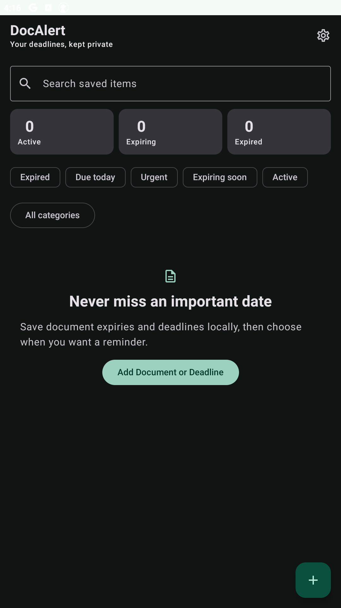<br><sub>Empty dashboard</sub></td>
    <td align="center">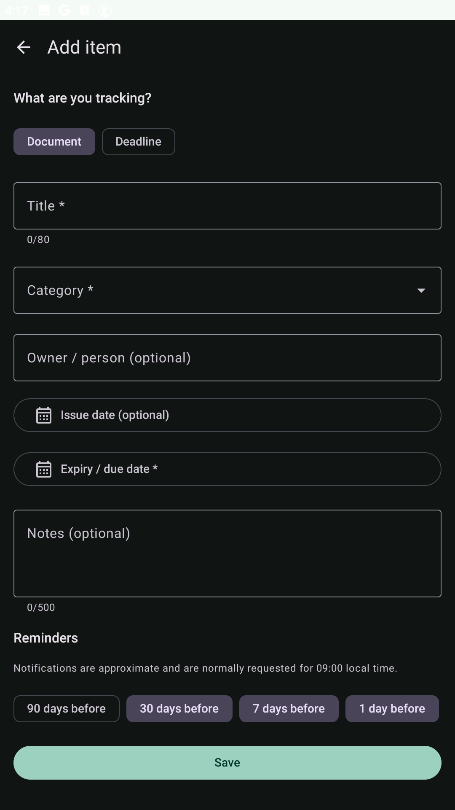<br><sub>Add a document or deadline</sub></td>
    <td align="center">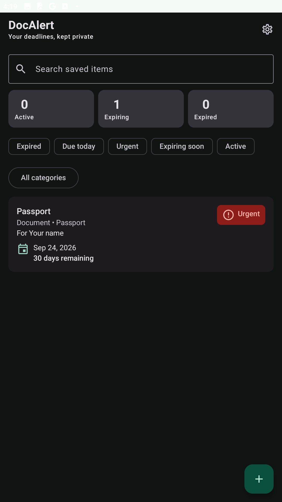<br><sub>Searchable status dashboard</sub></td>
  </tr>
  <tr>
    <td align="center">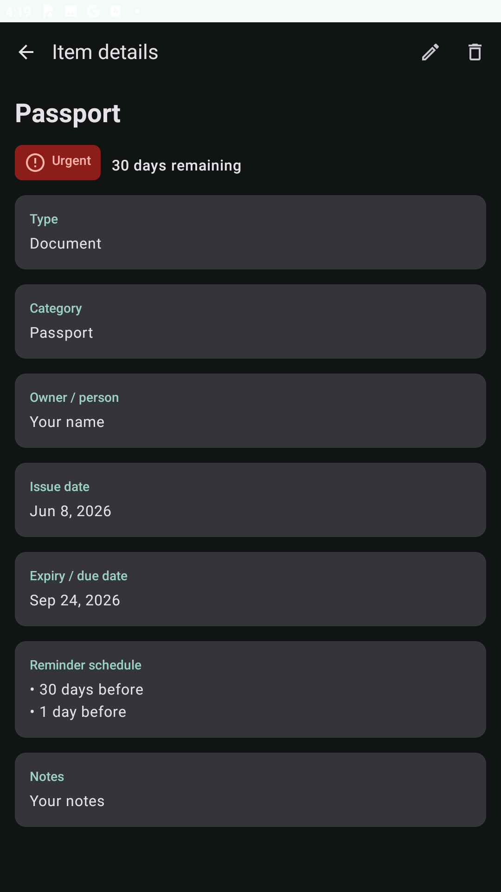<br><sub>Item details and reminders</sub></td>
    <td align="center">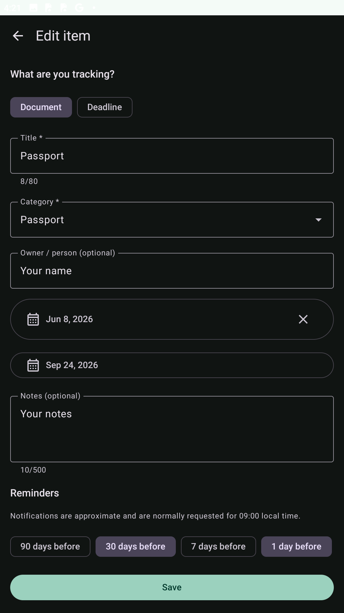<br><sub>Edit persisted metadata</sub></td>
    <td align="center">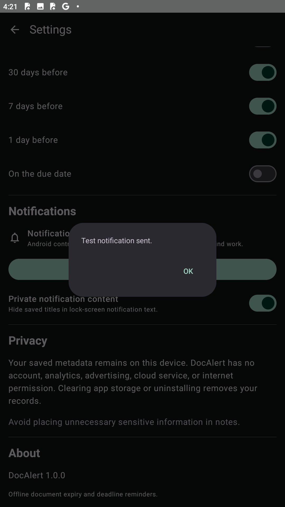<br><sub>Notification-flow confirmation</sub></td>
  </tr>
</table>

<details>
<summary><strong>Light and dark appearance</strong></summary>

<br>

| Dashboard — dark | Dashboard — light |
|---|---|
|  | 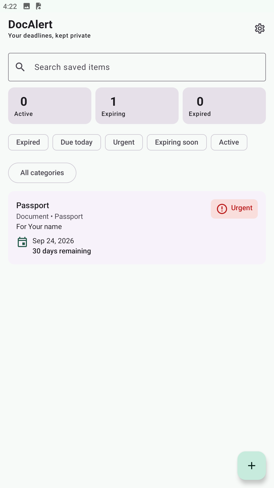 |

| Item details — dark | Item details — light |
|---|---|
|  | 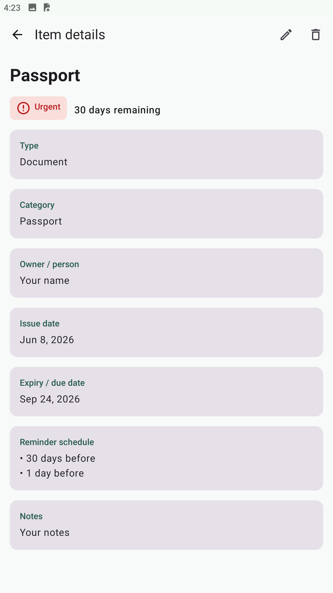 |

| Settings — dark | Settings — light |
|---|---|
| 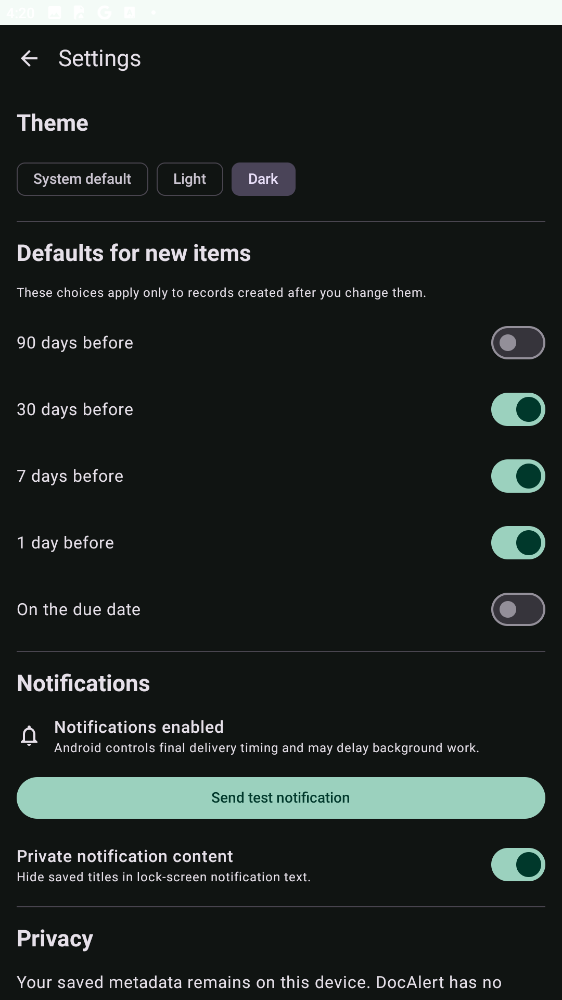 | 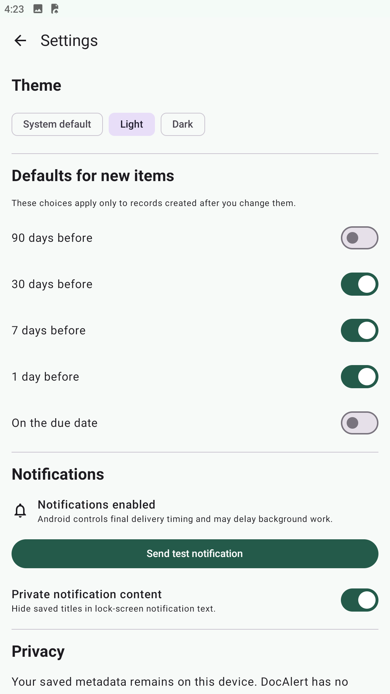 |

</details>

## Architecture

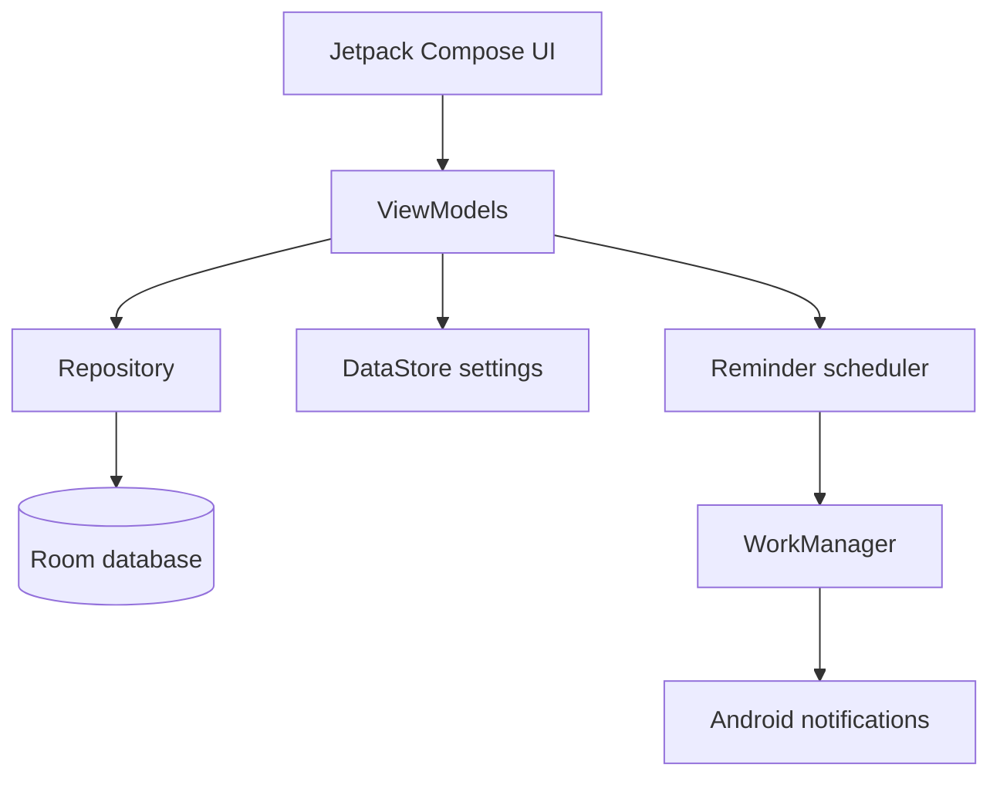

- **Compose** renders immutable UI state and emits user actions; it does not access DAOs or schedule work.
- **ViewModels** manage lifecycle-aware screen state and coordinate repositories, settings, and reminders.
- **Repository** separates application logic from Room persistence.
- **Room** stores document and deadline metadata locally, including ISO local-date values through explicit converters.
- **DataStore** saves theme, default-reminder, and notification-privacy preferences.
- **Reminder scheduler** creates stable unique jobs and replaces or cancels them when records change.
- **WorkManager** requests notification delivery under Android background-execution rules; timing is not exact.

Dependencies are wired manually through a single application-level `AppContainer`, keeping the single `app` module straightforward and testable.

## How it works

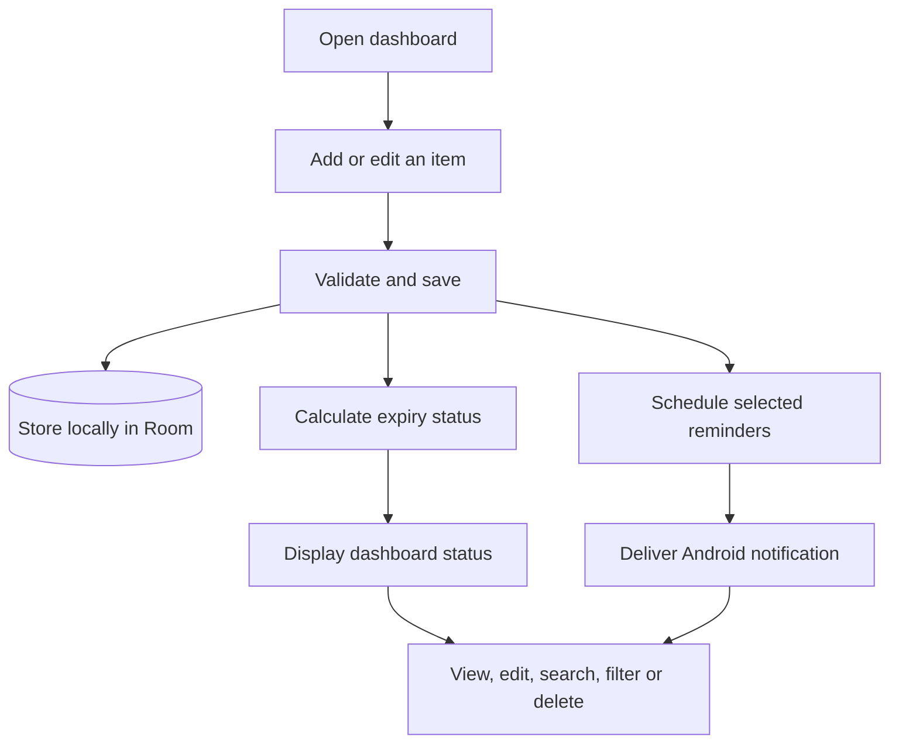

> A user adds a residence permit with its expiry date, chooses 90-, 30-, 7- and 1-day reminders, and saves it. DocAlert stores the record locally, calculates its current status, displays the remaining days, and schedules the selected approximate WorkManager reminders.

## Technology stack

| Layer | Technology | Responsibility |
|---|---|---|
| Language | Kotlin, Coroutines, Flow | Application logic and asynchronous state streams |
| UI | Jetpack Compose, Material 3 | Declarative screens, components, accessibility, and themes |
| Architecture | MVVM, repository pattern, manual `AppContainer` DI | Separation of UI, state, domain, and data responsibilities |
| Persistence | Room, KSP | Local record storage, converters, DAO queries, and schema export |
| Preferences | Preferences DataStore | Theme, reminder defaults, and private-notification preference |
| Background work | WorkManager, Android notifications | Unique approximate reminders and notification delivery |
| Navigation | Navigation Compose | Home, editor, details, settings, and notification destinations |
| Testing | JUnit, coroutine test utilities, Room test DB, Compose UI Test | Domain, ViewModel, persistence, scheduling, and UI verification |
| CI | GitHub Actions, Gradle Wrapper | Lint, unit tests, APK builds, wrapper validation, and artifact upload |

## Quality and verification

Verified for DocAlert 1.0.0:

- **18 JVM tests passed** across date boundaries, validation, search/filter/sorting, ViewModel state, reminder timing, stable work names, and private notification content.
- **7 instrumentation tests passed** for Room CRUD/repository behavior and Compose UI on a physical Samsung Galaxy A53.
- Physical-device acceptance passed on **Android 16 / API 36**.
- Android lint passed with **no issues found**.
- Debug and Android-test APKs assembled successfully.
- Cold launch, process-survival, WorkManager initialization, notification-channel, and crash/Logcat checks completed without an application failure.
- GitHub Actions CI passed on Java 17 and published the `DocAlert-1.0.0-debug` artifact.
- Installed-package review found no Internet, camera, microphone, location, or storage permission.

Automated and manual coverage includes date boundaries, validation, persistence, sorting and filtering, Room CRUD, recreation-safe ViewModel state, Compose UI semantics, reminder scheduling, permission acceptance/denial, notification privacy and navigation, themes, rotation, large fonts, offline behavior, and restart persistence.

See the [manual test plan](docs/TEST_PLAN.md) and [privacy documentation](docs/PRIVACY.md) for the full evidence boundaries and expected behavior.

## Installation and use

### For users and testers

1. Open the repository's [Android CI workflow page](https://github.com/de-himanshu19/android-document-deadline-reminder/actions/workflows/android.yml).
2. Select a successful run on `main`.
3. In **Artifacts**, download `DocAlert-1.0.0-debug`.
4. Extract the downloaded ZIP to obtain `app-debug.apk`.
5. Transfer the APK to a test device, open it, and allow installation from that selected file source when Android asks.

This artifact is a debug build for testing. It is not release-signed, published on Google Play, or intended as a production distribution. Workflow artifacts are retained for a limited time; use the workflow page to find a current successful run.

### For developers

Prerequisites:

- Android Studio compatible with Android Gradle Plugin 9.3.
- Android SDK Platform 37 and Build Tools 36.0.0.
- JDK 17 or newer; sources and bytecode target Java 17.
- A physical device or emulator for connected instrumentation tests.

Clone the repository, open its root directory in Android Studio, use the included Gradle wrapper, and allow Gradle synchronization and indexing to finish.

Windows PowerShell:

```powershell
.\gradlew.bat lintDebug
.\gradlew.bat testDebugUnitTest
.\gradlew.bat assembleDebug
.\gradlew.bat assembleDebugAndroidTest
.\gradlew.bat connectedDebugAndroidTest
```

macOS/Linux:

```bash
./gradlew lintDebug
./gradlew testDebugUnitTest
./gradlew assembleDebug
./gradlew assembleDebugAndroidTest
./gradlew connectedDebugAndroidTest
```

The debug APK is written to `app/build/outputs/apk/debug/app-debug.apk`. The connected test command requires an authorized device or running emulator.

## Project structure

```text
app/
├── schemas/                              Exported Room schema
└── src/
    ├── main/java/de/himanshu19/docalert/
    │   ├── data/local/                   Room database, DAO, entity, converters
    │   ├── data/repository/              Repository abstraction and Room implementation
    │   ├── data/settings/                Preferences DataStore settings
    │   ├── domain/model/                 Models, validation, status, filtering, sorting
    │   ├── navigation/                   Navigation Compose routes and permission flow
    │   ├── notifications/                WorkManager scheduling and notifications
    │   └── ui/                           Home, editor, details, settings, components, themes
    ├── test/                             JVM unit and ViewModel tests
    └── androidTest/                      Room and Compose instrumentation tests
docs/                                    Privacy, test plan, verified screenshots
.github/workflows/android.yml             Android CI and debug artifact upload
```

## Privacy

DocAlert stores metadata only in its private local Room database and settings in Preferences DataStore. It has no account, tracking, advertising, cloud transfer, crash-reporting service, or `INTERNET` permission. Backup and device-transfer extraction are disabled, and the private notification-content setting can prevent saved titles from appearing in notification text.

Uninstalling the app or clearing its storage removes its local database and preferences. Avoid storing unnecessary sensitive information in titles or notes. Read the complete [DocAlert privacy information](docs/PRIVACY.md).

## Project links

- [Source repository](https://github.com/de-himanshu19/android-document-deadline-reminder)
- [Android CI runs and debug artifacts](https://github.com/de-himanshu19/android-document-deadline-reminder/actions/workflows/android.yml)
- [Privacy documentation](docs/PRIVACY.md)
- [Manual test plan](docs/TEST_PLAN.md)
- [Screenshot inventory](docs/screenshots/README.md)

## Limitations and roadmap

### Version 1 limitations

- Reminder delivery is approximate because WorkManager and Android control final execution timing.
- Data remains on the local device; there is no account sync or cloud backup.
- No attachments, document scanning, or OCR.
- No import/export or renewal-history archive.
- No release signing or Google Play publication.

### Possible future work

- OCR-assisted date capture.
- Encrypted export and backup.
- Optional biometric protection.
- Renewal history.
- Localization.
- Release hardening and Play Store preparation.

These are roadmap ideas, not implemented Version 1 features.

## Author

**Himanshu Choudhary** · [GitHub](https://github.com/de-himanshu19)

> DocAlert demonstrates end-to-end native Android development, including Compose UI, offline persistence, lifecycle-aware state management, background scheduling, automated testing, physical-device validation, and continuous integration.
